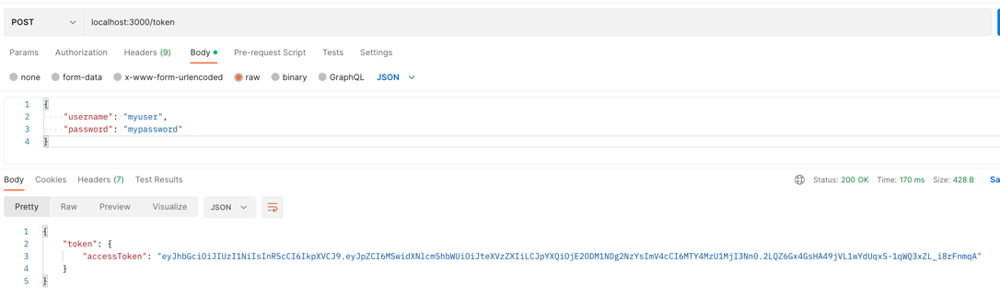
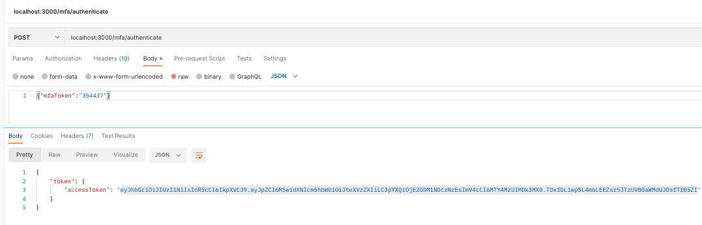

## nodejs-jwt

## setup 
### dependencies
- node version 18.12.0
- yarn (npm install -g yarn )

### installation and setup 
- yarn install 
- docker-compose up 
- yarn run migrate ## migrate required database tables. 

## run 
- yarn run 


## assignments 
### assignment part 1 - 
#### create /token endpoint 


#### create /about endpoint that uses the token 


#### access denied if token is expired or invalid


#### bonus - how to test this? 
Testing manually, we could use postman and make various API calls. The existing library in this repository,
we can generate a token that lasts only 1 second and will be expired. 

```javascript
function generateToken(payload, expiresIn = 3600) {
  // token default lasts 1 hr
  return jwt.sign(payload, process.env.JWT_SECRET, {expiresIn: expiresIn});

console.log(generateToken({user_id: 1, user_name: "myuser"}, 1));
```

### assignment part 2 - 
The access token can be expired. Design a new API to allow the client to securely and automatically regenerate a new token. 

- Typically when token expired, the JWT verify would just fail. 
- If it is not yet expired, we can explicitly blacklist an existing token, and issue a new one. All future calls to authenticate routes would check 
  the blacklist. 
- A blacklist middleware is invoked when using /logout route
- I added a mfa authentication related paths which would issue new JWT tokens if the MFA token provided is correct. f

MFA Demo



Couple other best practices for token based authentications: 
- Keep the time to live as short as possible for the tokens but not so short that it inconvenience the users. 
- Make sure it is stored in a way that other applications are not able to hijack the tokens. Hence using JWT tokens, we should have good control 
  of the client side application and we can program the clients not expose it unsecurely. JWT is known for XSS attacks. 
- Always use HTTPS
- Securely save the "secret" for jwt tokens and rotate every once in awhile. 
- Don't put sensitive information into the JWT tokens
- Use MFA.

## Challenge 2 
### How would you implement pagination API to retrieve records from high volume database? 
For high volume database, we need to pay special attention of keeping our resource usage efficient and minimum. We should queries that would fetch 
results right away. Majority of the time, your options of using pagination is limited by the ability of what is the underlying database, not your 
own custom software programming. But good thing most traditional RDBMS has good support of both pagination techniques. The "Cursor" based is 
typically the more efficient pagination technique. but requires more setup. 

### Discuss two pagination schemes and their pros and cons? 
#### Cursor Based Pagination 
- For large data sets that would grow exponentially, this is the defacto method to use for pagination. It works by 
providing the user like a bookmark in this case an actual pointer or index of the storage of where the page is left off from. This also means 
The data is organized in a certain way that the next time the next bookmark is picked up from, we can consistently retrieve the next batch of 
records. For example, if we want to build pagination on user id, it would be relatively simple to implement since user id are incrementing numbers. 
But if we were to do pagination based on First Name, we would have need to prepare this kind of query pattern before hand such as custom insert statements,
partitions, indices, etc. Overall the cost of initial tech investment would pay off with the impressive performance later on. Facebook is known for 
moving a majority of their graphql apis to cursor based pagination from offset based. 

#### Offset Based Pagination 
- Offset based pagination in contrast may not need setup at all. If the Read speed is consistent and data is known to be small, and does not have to 
be ordered (redundant data or missing data in the combined results is OK)
offset based pagination is easy to implement and may solve your use cases. Offset based pagination typically requires querying a large portion of the 
dataset, and reducing a portion of it to be delivered to clients. The performance issues would come in if the records are in hundred thousands. 
One interesting use case of offset based pagination are Timelines such as Twitter or Facebook. Users are unlikely to visit hundreds of thousands 
  of timeline events, they are interested maybe in the top 20 events. And the underlying storage is most likely a time series type of database, 
  which is already somewhat sorted. 

### Give examples of client request messages and server response messages in each scheme. 
#### Cursor

Client request - GET /api/v1/products?limit=10&after=abcd

Server Response
```json
{
  "count": 100, // sometimes not provided. 
  // sometimes just next id is provided, it does not keep track of previous ids. 
  // below is an "ideal" API. 
  "next": "/api/v1/products?limit=10&after=cdef",
  "previous": null,
  "results": [
    {
      "id": 21,
      "name": "Product 21",
      "price": 10.99,
      "description": "Description of product 21"
    }
    ...
  ]
}

```


#### Offset based sample messages 
client - "/v1/users?offset=0&limit=10"
```json
{
  "count": 100, // sometimes not provided
  // sometimes just provide "offsets" and "limit" as a separate field. It may not 
  // provide the next and previous full urls. 
  "next": "/api/v1/products?offset=10&limit=10",
  "previous": null,
  "results": [
    {
      "id": 21,
      "name": "Product 21",
      "price": 10.99,
      "description": "Description of product 21"
    }
    ...
  ]
}

```

#### Mention any third party tools/library you would use 
- Don't know of any good tools or libraries, but have seen these libraries tightly coupled with famous ORMs.  


